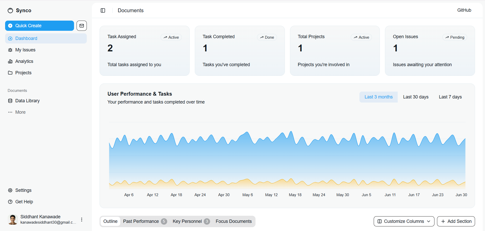

# Project Management Dashboard

A modern project management application built with Next.js for tracking tasks, managing projects, and organizing issues.




## Email notifications


## Features

- Task management with status tracking
- Project organization and filtering
- Issue tracking system
- Responsive dashboard interface
- Real-time data updates via emails

## Getting Started

Run the development server:

```bash
git clone https://github.com/SiddhantKanawade30/synco.git
cd synco
npm install
npm run dev
```

Open [http://localhost:3000](http://localhost:3000) to view the application.

## Tech Stack

- Next.js 16
- TypeScript
- Tailwind CSS
- Shadcn/ui components
- TanStack Table

## Deployment

Build for production:

```bash
npm run build
npm start
```

